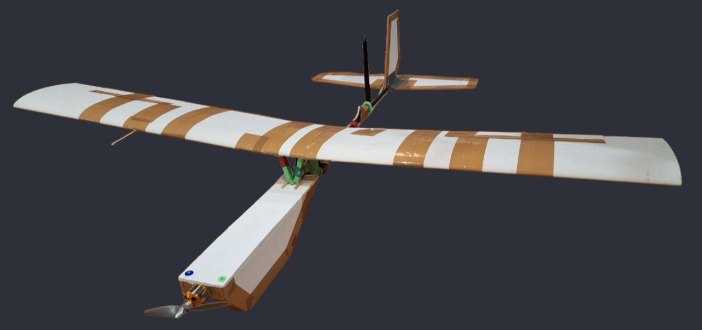
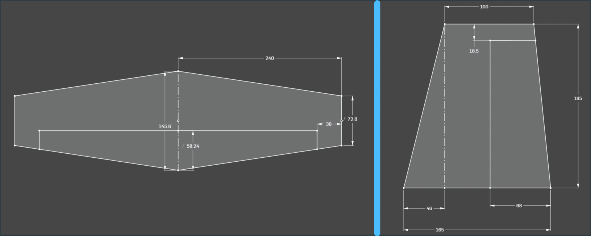

## Introduction

A Small Flying Dream is a fixed-wing, RC-controlled aircraft developed between 2022 and 2025. The aim of this project was to design and build as many systems as possible on the airplane from scratch. Initially, the maker had a limited understanding of how airplanes function. Over the course of this project, he gained a solid understanding of aerodynamics, control engineering, sensor fusion, coding in both C++ (Arduino framework) and Python. It also significantly improved his skills in 3D-printing and electronics.

The final version of the project includes four parts: the aircraft, the radio transmitter, the telemetry receiver and the Ground Station App.

The CAD model was designed in Onshape, and simulations were done primarily in XFLR5.

## Dimensions

The table below shows the main wing parameters.

| Parameter        | Value       |
| ---------------- | ----------- |
| Airfoil          | Curtis C-72 |
| Wingspan         | 1140 mm     |
| Geometry         | Rectangular |
| AR               | 7.125       |
| AoI at wing root | 3°          |
| AoI at wingtip   | 1°          |
| Dihedral         | 3.5°        |

The ailerons are rectangular, with a width equal to 20% of the wing chord and a length equal to 40% of the half-span. They are positioned such that there is an 80 mm gap between the aileron and the wingtip.

The horizontal and vertical stabilizers are made from 5 mm foam board, both with a taper ratio of 0.5. Their exact dimensions are shown in the schematic below:

The total length of the aircraft is 800 mm and weighs a little over 1 kg. Additional weight was added to the tail to move the CG rearward, as the plane was initially too nose-heavy.

## Design and Materials

The wings are 3D-printed from lightweight PLA and reinforced with two wooden spars. Each wing is made from three, and each aileron from two, separately 3D-printed parts. During assembly, the three wing sections are aligned using a precise assembly jig and fixed in place by inserting two wing spars. The ailerons are connected to the wing by three hinges.

All major aircraft components are mounted around a 10 x 8 mm carbon fiber tube. They are secured using 3D printed mounts and M2 or M4 bolts. The tail and motor mounts also have bolts through the carbon fiber tube to ensure precise alignment. The motor axis is tilted 1.5° to the right to counteract the propeller's P-factor.

## Electronics

Flight controller: ESP-WROOM-32 development board

ESC: Phoenix Ice Lite 100

Motor: Kyrio A2212 2200Kv with APC 6x4E propeller

Battery: 3S 2200 mAh LiPo

Servos: ZHITING ES08MA II 12 g

Radio: E01-ML01DP5 module with 5dBi antenna

IMU: Adafruit ICM-20948 module

Barometer: Adafruit DPS310 module

GPS: NEO-M8N module

Airspeed sensor: AUAV MS4525 R01 module

SD card: generic SPI microSD card adapter

[Schematic](docs/Schematic_Drone-FC.png)

## Transmitter

The transmitter is designed around an ESP-WROOM-32 development board and powered by a 2S LiPo battery through an LM7805 voltage regulator.

The user interface consists of a 128 x 64 px OLED screen, five buttons, three control sticks, and an indicator LED. The buttons are used to navigate the on-screen menu.

The control sticks are assigned as follows:
- throttle
- elevator position (pitch setpoint)
- both aileron and rudder positions simultaneously (roll setpoint)

An ADS1115 ADC module is used to measure the control stick potentiometer values.

The controller has two radio modules: E01-ML01DP5 for a radio link with the airplane and HC-12 module for forwarding telemetry.

## Software

The firmware is coded in C++ using the Arduino framework in PlatformIO. It uses third-party libraries for communicating with sensors, controlling servos, and saving data. A basic flowchart of the control loop can be seen [here](docs/SoftwareFlowchart-1.png).

A data packet received from the transmitter consists of either 3 or 8 bytes. When 3 bytes are received, each byte represents the position of one control stick. Otherwise, the 8 bytes make up a command. Each of the 8 bytes in a command represents a character. A full list of commands can be seen [here](docs/Commands.md). 

Altitude, airspeed, air temperature, and battery voltage are passed through a low-pass filter for smoothing. Roll Stabilization, Pitch Stabilization, and Altitude Hold modes use PID control loops to minimize oscillations. Altitude Hold mode is coded but not yet fully tested.

## Ground Station App

The Ground Station App is developed in Python using the Pygame library. It is designed to monitor and visualize the state of the aircraft.

The Ground Station App features:
- display of incoming telemetry data
- visualization of the aircraft's position on a map
- the ability to send commands
- access to various system parameters

In order to start the app, the telemetry receiver must be connected to a computer. The telemetry is received using an HC-12 radio module and  an ESP32 development board, which writes the data to a serial port. The Ground Station App is able to read and process this data for display. When GPS telemetry data is available, the app displays the position of the aircraft on a map. However, the map of the flight area needs to be downloaded before starting the app. 

List of telemetry variables can be seen [here](docs/Commands.md).

## Conclusion

A Small Flying Dream successfully demonstrates the feasibility of developing a UAV platform with limited resources and little prior knowledge. The finished project features four subsystems, all of which were designed and built from scratch.

Throughout the project, the developer encountered and solved numerous unforeseen challenges. The most difficult among them was the stabilization system, which was solved by utilizing the DMP data from the IMU. Overcoming these challenges significantly enhanced the maker’s skills in electronics, control engineering, 3D-printing and coding.

The performance of the finished project is satisfactory. The pilot is able to control the plane and fly it to precise locations. Planned future improvements include full testing of the Altitude Hold mode and a fully autonomous GPS-guided mode for waypoint missions.
